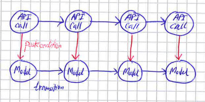
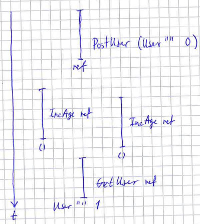
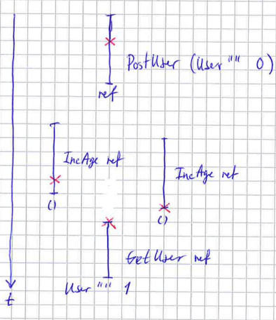
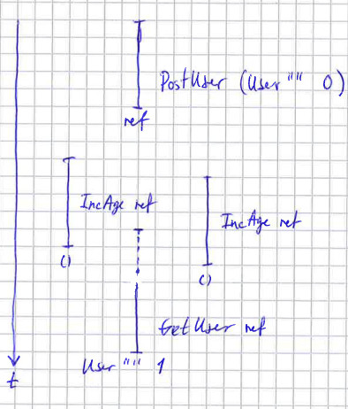
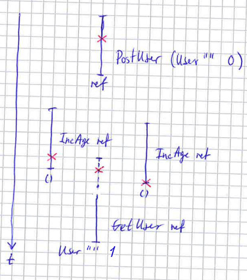

% Testing monadic programs using QuickCheck and state machine based models
% Stevan Andjelkovic
% 2018.2.23, BOBKonf (Berlin)

# Introduction

* Property based testing in general
* How to apply property based testing to stateful and concurrent programs
* Running example, simple CRUD web application
    - Familiar type of program
    - Obviously stateful and concurrent
    - Non-obvious property?
* Using the
  [`quickcheck-state-machine`](https://github.com/advancedtelematic/quickcheck-state-machine)
  Haskell library, but the principles are general

---

# Overview

* Reminder
    - What are property based tests?
    - Why are they so effective?
* Basic idea and motivation behind how the library applies property based
  testing principles to stateful and concurrent programs
* Demo
    - Sequential property (catches logic and specification bugs)
    - Concurrent property (catches race conditions)
* Comparison to other tools

---

# Property based testing

* Unit tests

```haskell
      test :: Bool
      test = reverse (reverse [1,2,3]) == [1,2,3]

```

* Property based tests

```haskell
      prop :: [Int] -> Bool
      prop xs = reverse (reverse xs) == xs
```

. . .

* Proof by (structural) induction

      $\quad\;\forall xs(\textsf{reverse}(\textsf{reverse}(xs)) = xs)$

. . .

* Type theory

```haskell
      proof : forall xs -> reverse (reverse xs) == xs
```

---

# Stateful programs, basic idea / motivation

* Take inspiration from physics
    - Simplified model of reality that can predict what will happen
    - Experiments against reality validate the model

* How do we model algorithms/programs?

    - Gurevich's abstract state machines/new thesis, think of finite
      state machines where the states are arbitrary datatypes

* Abstract state machines are used by:

    - Quiviq's closed source version of QuickCheck for Erlang (Volvo
      cars, ...) [@erlang]

    - Z/B/Event-B familiy (Paris metro line 14)

    - TLA+ (AWS, XBox)

    - Jepsen (MongoDB, Cassandra, Zookeeper, ...)

---

# The `quickcheck-state-machine` library

* Use abstract state machine to model the program
    - A model datatype, and an initial model
    - A datatype of actions (things that can be happen in the system we are modelling)
    - A transition function that given an action advances the model to the
      next state

* A semantics function that takes an action and runs it against the real system

* Use pre- and post-conditions on the model to make sure that the model agrees
  with reality [@floyd; @hoare]

* Use QuickCheck's generation to conduct experiments that validate the
  model

    - Sequential property
    - Parallel/concurrent property [linearisability, @linearisability]

---

# State machine model

\


---

# Demo

* Simple web application
    - `data User { name :: Text, age :: Int }`
    - Create user (post request)
    - Read/lookup user (get request)
    - Update age (put request)
    - Delete user (delete request)

* Implementation
    - Servant and persistant
    - Could be written using any libraries or language
    - Completely independent of `quickcheck-state-machine`

* Specification

    - Uses the `quickcheck-state-machine` library in the way described
      above

---

# Demo

---

# Linearisability (fails)

* [@linearisability]

\


---


\


---

# Linearisability (succeeds)

\


---


\


---

# Comparison to other tools

* Quiviq's Erlang QuickCheck
    - More polished and used
    - Better statistics
    - Closed source

* Z/B/Event-B
    - Deductive proving (heavily automated)
    - Refinement
    - Notation

* TLA+
    - Model checking (proving is also possible)
    - Liveness and fairness properties can be expressed
    - No connection to actual implementation

* Jepsen
    - Does fault injection (e.g. network partitions)
    - No shrinking (is it even possible?)

---

# Conclusion

* State machines are useful for modelling programs

* Race condition testing for free via linearisability

* See also

    - `quickcheck-state-machine` library on GitHub
    - Oskar's talk
    - Matthias' tutorial

---

# References
